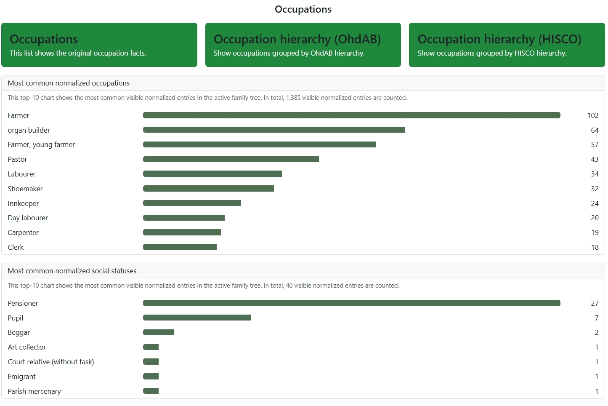
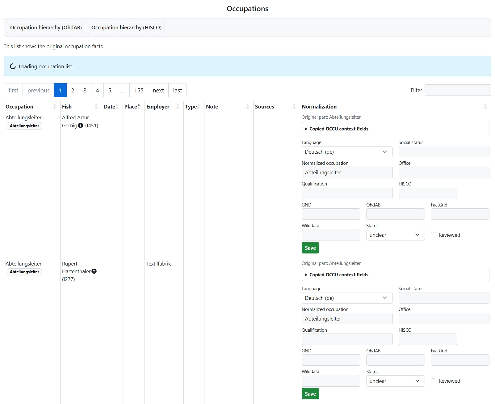
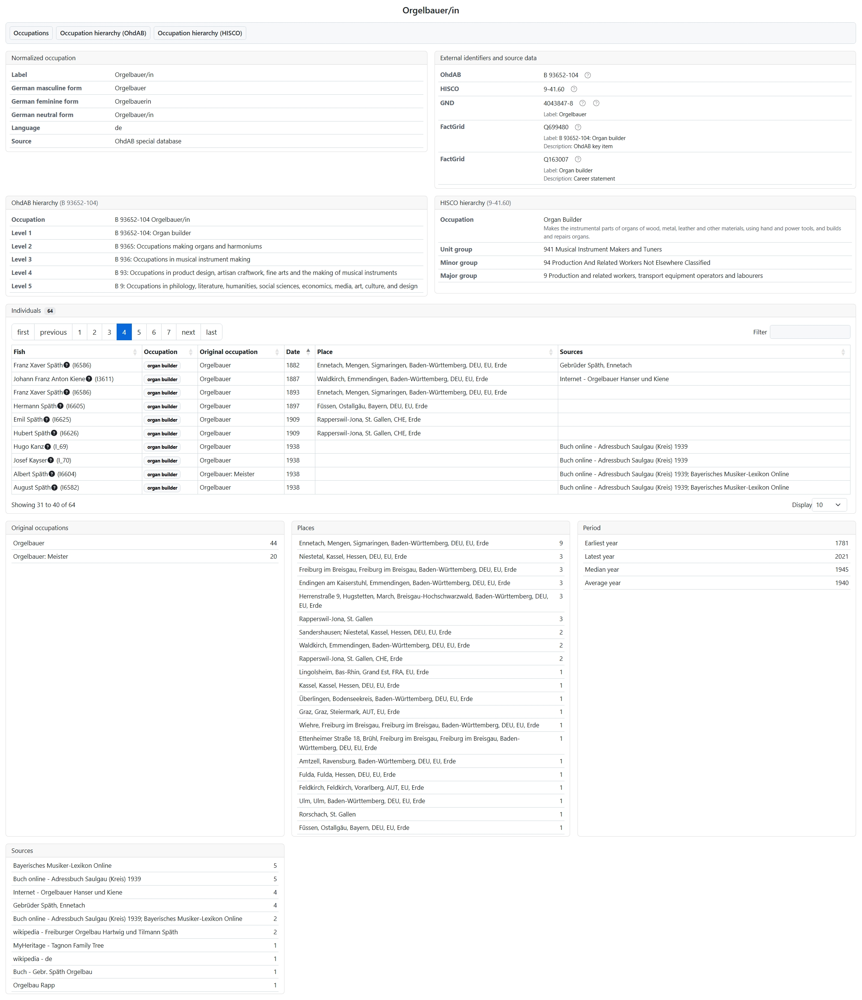
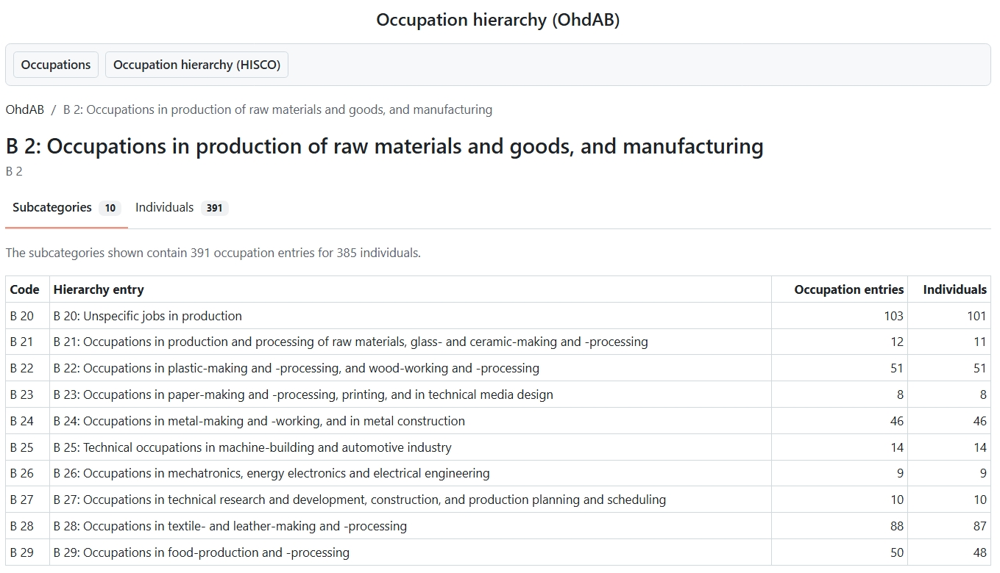
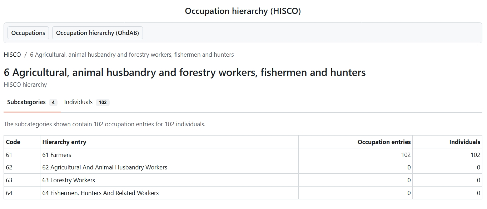

# **webtrees** module: Occupation Standardizer

[](http://www.gnu.org/licenses/gpl-3.0)


This [webtrees](https://www.webtrees.net) module helps analyze, normalize, classify, and display historical occupation entries in genealogical sources.

This is a beta version. Do not use it in a productive system without careful testing.

<a name="Contents"></a>
## 📚 Contents

* [Purpose](#Purpose)
* [Main features](#MainFeatures)
* [User roles](#UserRoles)
* [Occupation landing page](#LandingPage)
* [Occupation list](#OccupationList)
* [Occupation labels](#OccupationLabels)
* [Occupation profile pages](#OccupationProfiles)
* [Occupation hierarchies](#OccupationHierarchies)
* [Administration](#Administration)
* [Privacy](#Privacy)
* [Data sources](#DataSources)
* [Screenshots](#Screenshots)
* [Documentation](#Documentation)
* [Requirements](#Requirements)
* [Installation](#Installation)
* [Translation](#Translation)
* [Credits](#Credits)
* [License](#License)

<a name="Purpose"></a>
## 🎯 Purpose

Historical church book entries and historical address books often combine occupations, social status, offices, 
honorary offices, employers, and qualifications in a single phrase.
For example, `Bürger und Weingärtner` contains both a social status and an occupation, while `Arztwitwe` may point to the former occupation of a deceased husband rather than to the occupation of the recorded woman.

Occupation names are among the most frequent person-specific details in genealogical sources.
They are useful for social-structural analysis, local history, economic history, medical history, and many other research questions.
Occupation classifications may focus on activity profiles and industries, education and qualification levels, or social prestige and social structures.

Occupation terms are also often gender-specific, for example `Magd`/`Knecht`, `Arzt`/`Ärztin`, or `Orgelbauer/in`.
For searching, grouping, and analysis, these variants should point to the same normalized occupation concept.
For display next to a concrete person, however, the module should use the appropriate gender-specific or neutral label where available.

The module is deliberately conservative: it does not change GEDCOM data automatically.
The original occupation text remains the genealogical source value.
Normalized interpretations are stored in module-owned database tables and can be reviewed separately.
A later transfer of selected module-owned information back into GEDCOM is intended, but the exact form and target structures still need to be clarified.

<a name="MainFeatures"></a>
## ⚙️ Main Features

The module currently provides:

* a new webtrees list-menu entry for occupations
* a landing page with entry points for occupation facts, OhdAB hierarchy, HISCO hierarchy, frequency analysis, and inheritance analysis
* a read-only occupation overview for visitors and members
* editable normalization rows for managers and administrators
* occupation labels next to `INDI:OCCU` facts
* occupation profile pages for normalized occupations
* OhdAB hierarchy browsing based on an imported tailored OhdAB extract
* bundled HISCO catalog tables for local HISCO lookups
* automatic assignment of unambiguous HISCO codes from English masculine occupation labels while preserving manually maintained codes
* HISCO hierarchy browsing based on stored HISCO identifiers
* top-10 frequency charts for normalized occupation and social-status entries
* HISCLASS distributions and mean HISCAM U1 scores per visible individual
* a graphical and tabular inheritance analysis for normalized occupation and social-status entries between parents and children
* links to external identifiers such as OhdAB, FactGrid, GND, Wikidata, and HISCO
* module settings for rules, tree languages, normalization mappings, norm-data import, and maintenance
* a documented public read-only API for occupation normalization by other webtrees modules

The module currently focuses on individual `INDI:OCCU` facts.
Other possible places for occupation-related information, such as military rank, education, offices, or custom GEDCOM structures, are tracked separately.

<a name="UserRoles"></a>
## 👥 User Roles

**Visitors and members**

Visitors and members can use the list-menu entry and see occupation data that webtrees already allows them to see.
The module respects webtrees privacy checks for individuals and occupation facts.
They can browse the occupation landing page, occupation list, hierarchy views, social-status analyses, and occupation profile pages.

**Managers**

Managers can open the occupation list for a tree and thereby create or synchronize the module-owned normalization rows for that tree.
They can edit stored normalization entries, copied OCCU context fields, identifiers, status values, and the explicit reviewed flag.
These edits affect only the module tables, not the GEDCOM data.

**Administrators**

Administrators can configure site-wide module behavior in the control panel.
They can maintain built-in rule order and activation, tree language defaults, local normalization terms and mapping rules, imported OhdAB data, and maintenance actions such as deleting module-owned rows for a selected tree.

<a name="LandingPage"></a>
## 🧭 Occupation Landing Page

The list-menu entry opens a landing page for the active family tree.
It provides six main action tiles:

* **Occupations** - opens the list of original occupation facts.
* **Occupation hierarchy (OhdAB)** - opens the hierarchy from imported OhdAB norm data.
* **Occupation hierarchy (HISCO)** - opens the hierarchy from the bundled HISCO catalog.
* **Frequency analysis** - shows top-10 charts for normalized occupations and social statuses.
* **Inheritance analysis** - compares normalized occupation or social-status entries between parents and children.
* **Social status analysis** - shows HISCLASS 12/5 distributions and HISCAM U1 scores for the active family tree.

The frequency analysis shows top-10 charts of the most common visible normalized occupation and social-status entries in the active family tree.
These charts are based on active module-owned normalization rows for the selected tree.

The inheritance analysis shows the ten strongest parent-child flows as a compact graphic and keeps the full aggregated data table below it.
The graphic is intentionally limited to the top 10 flows for readability.
All families in which a person is linked as a child are included, regardless of the recorded relationship type.
Repeated links between the same parent and child are counted only once.
It can be switched between occupation inheritance and social-status inheritance.
For occupations, the analysis level can be switched between normalized terms, OhdAB hierarchy levels, and HISCO hierarchy levels.
For social statuses, normalized entries and OhdAB hierarchy levels are available.

The social-status analysis counts every visible classified normalized
occupation once in the HISCLASS histograms, independently of how many
individuals have this occupation. For the person-based analysis, all visible
occupation entries with an available HISCAM U1 value are collected per
individual. The current first-stage score is their unweighted arithmetic mean.
Individuals without an available HISCAM U1 value are omitted. A separate tree
score is calculated as the arithmetic mean of the displayed individual scores.

<a name="OccupationList"></a>
## 📋 Occupation List

The occupation list reads individual `OCCU` facts and shows:

* original occupation text
* individual
* date
* place from `PLAC`, with linked shared-place hierarchy from `_LOC` when available
* employer or responsible agency from `AGNC`
* `TYPE`
* `NOTE`
* linked sources
* normalization labels and, for managers, editable normalization entries

If no occupation facts exist in the selected family tree, the list remains available and shows a suitable message.

One original occupation phrase can create several module rows.
For example, a phrase can be split into separate entries for status, occupation, office, or qualification.
Copied context fields remain editable because, after splitting, a date, place, source, employer, or note may apply to only one of the interpreted parts.

<a name="OccupationLabels"></a>
## 🏷️ Occupation Labels

Labels are shown next to occupation facts on the standard facts-and-events tab and in supported Vesta fact views.
The label text is selected from the normalized occupation term.
If available, the module prefers gender-specific or neutral labels and chooses German or English according to the user's language.

The label tooltip can show:

* language
* normalized occupation
* German and English masculine, feminine, and neutral forms
* social status
* office
* qualification
* OhdAB hierarchy
* HISCO hierarchy
* external identifiers
* normalization status and applied rule numbers

Labels link to occupation profile pages when a normalized concept id is available.

<a name="OccupationProfiles"></a>
## 🧾 Occupation Profile Pages

Each normalized occupation can have a profile page for the active tree.
The URL uses the module's internal concept id, for example:

```text
/tree/<tree>/occupation-standardizer?view=occupation&source=ohdab&concept_id=<id>
```

The profile page combines internal module data and external authority information.
It can show:

* normalized occupation details
* external identifiers and source data
* GenWiki occupation links
* multilingual Wikipedia links and a language-appropriate introductory paragraph
* OhdAB hierarchy
* HISCO hierarchy, when a HISCO code is available
* locally resolved HISCAM U1, HISCAM NL, OCC1950, HISCLASS, and HISCLASS 5 values
* visible individuals in the active tree who exercised this occupation
* original occupation variants mapped to this normalized occupation
* places
* time span statistics
* source references

External authority information is cached in module-owned tables where applicable.
Wikipedia introductory paragraphs are cached for 30 days.
Managers and administrators can replace automatically discovered Wikidata
sitelinks with a manually maintained language-and-link list.
Administrators can synchronize these automatic links from Wikidata for one
normalized occupation or for all normalized occupations. Manually maintained
lists are never overwritten by this action.
The profile page shows source references for displayed external data.
Managers and administrators can additionally open a collapsed technical status
table for online sources. If a service is temporarily unavailable, the last
valid cached response remains visible and is marked as stale in this table.

<a name="OccupationHierarchies"></a>
## 🌳 Occupation Hierarchies

**OhdAB hierarchy**

The OhdAB hierarchy is available after importing a tailored German OhdAB Excel extract.
The hierarchy browser starts at the top level and allows drilling down into lower levels.
For each visible level, the module shows occupation-entry counts and individual counts for the active family tree.
A persons tab lists visible individuals for the selected hierarchy entry.

**HISCO hierarchy**

The module ships a normalized English HISCO catalog in `resources/data/hisco`.
It is imported into local module tables on first use and is used to resolve HISCO identifiers without calling an external service.
Bundled crosswalk workbooks add HISCAM U1, HISCAM NL, OCC1950, HISCLASS, and
HISCLASS 5 values and are reimported whenever either workbook changes.
The HISCO hierarchy browser shows major groups, minor groups, unit groups, and occupations.
For each selected level, matching persons are listed if their normalized occupation entries contain a HISCO identifier.

<a name="Administration"></a>
## 🛠️ Administration

The control-panel settings provide:

* built-in normalization rules with activation and ordering
* a reset action for the default rule order
* import of a tailored German OhdAB XLSX file
* OhdAB category statistics
* HISCO catalog table statistics
* HISCO category statistics
* normalized occupation terms with German and English gendered labels
* external identifiers for normalized occupation terms
* site-wide mapping rules from original text and language to normalized terms
* per-tree default occupation language
* module table statistics per family tree
* deletion of module-owned normalization data for a selected tree

Managers and administrators can edit normalization rows in the occupation list.
Administrators configure reusable rules and norm data in the control panel.

<a name="Privacy"></a>
## 🔒 Privacy

The module stores normalized interpretations and copied `OCCU` context in
module-owned database tables. It does not modify GEDCOM data automatically.

Occupation profile pages and hierarchy labels can retrieve public authority
information through server-side HTTPS requests from:

* **Wikimedia Foundation** for Wikidata labels and descriptions, Wikipedia
  language links, and introductory article text
* **FactGrid** for labels and descriptions associated with FactGrid and OhdAB
  identifiers
* **lobid-gnd**, operated by the North Rhine-Westphalian Library Service Centre
  (hbz), for GND labels and descriptions

These requests contain the relevant public authority identifier, where needed
the requested interface language or Wikipedia article title, and ordinary
technical request metadata such as the web server's IP address and user agent.
They do not contain genealogical personal data or the visitor's IP address.
Visitors can indirectly cause such a server-side request when they open a page
whose cached authority data is missing or stale.

Responses are cached locally to minimize external requests. Most authority
responses are refreshed after 24 hours; Wikipedia introductory text is cached
for 30 days. If a current request fails, previously cached authority data may
be displayed as stale data.

The bundled HISCO catalog, imported OhdAB extracts, and bundled GenWiki link
table are processed locally. Links to GenWiki, GND Explorer, HISCO, and other
external pages cause a direct connection only when a visitor follows the link;
they are not automatic API transfers by this module.

The place card on an occupation profile contains an interactive Leaflet map.
It uses Leaflet and MarkerCluster from the webtrees asset bundle and loads map
tiles from OpenStreetMap Deutschland (`tile.openstreetmap.de`) only after a
visitor opens the map tab. This creates a direct browser connection to FOSSGIS
e.V. that can transmit the visitor's IP address, browser request metadata, and
the requested tile coordinates and zoom levels.

The module exposes this information through its public `privacyNotices()`
method. `hh_legal_notice` can use this method to include the third-party
services and caching measure in a generated privacy policy. The lightweight
method-based contract keeps both modules independently installable.

Other webtrees modules can obtain the active module through `ModuleService` and
its public `OccupationStandardizerInterface`. The API resolves individual or
batched raw `OCCU` values without exposing the module's database schema. Its
result separates the canonical grouping term from language- and
gender-dependent display labels. See
[`docs/public-api.md`](docs/public-api.md) for the contract and an integration
example.

<a name="DataSources"></a>
## 🔗 Data Sources

**OhdAB**

The first M4 workflow supports a tailored German OhdAB Excel extract.
The uploaded file is imported into module-owned norm tables and then deleted.
The module stores original spellings, normalized concepts, FactGrid identifiers, and OhdAB hierarchy.
The rule "Normalize with external OhdAB special database" applies only to German occupation terms and runs after the local mapping table and before the fallback rule.

**HISCO**

The HISCO classification is described by Marco H. D. van Leeuwen, Ineke Maas,
and Andrew Miles, *HISCO: Historical International Standard Classification of
Occupations*, Leuven University Press, 2002.

The bundled catalog and classification crosswalks are derived from Kees
Mandemakers et al., *Standardized, HISCO-coded and classified occupational
titles, release 2018.01*, version 3.1, IISG Amsterdam, 2018:
https://datasets.iisg.amsterdam/dataset.xhtml?persistentId=hdl:10622/MUZMAL

The English source labels and descriptions are preserved.
Upper hierarchy levels are prepared for translated labels.

**External identifiers**

The module can store and display identifiers for:

* OhdAB
* HISCO
* FactGrid
* GND
* Wikidata

<a name="Screenshots"></a>
## 🖼 Screenshots

**Occupation landing page**

<p align="center"></p>

**Occupation list and normalization form**

<p align="center"></p>

**Occupation profile page**

<p align="center"></p>

**OhdAB hierarchy**

<p align="center"></p>

**HISCO hierarchy**

<p align="center"></p>

**Control panel settings**

<p align="center"></p>

<a name="Documentation"></a>
## 📖 Documentation

Additional documentation:

* [CHANGELOG.md](CHANGELOG.md) - release notes and noteworthy changes.
* [docs/normalization-rules.md](docs/normalization-rules.md) - implemented normalization rules.
* [docs/database-schema.md](docs/database-schema.md) - module-owned database tables.
* [docs/data-scope.md](docs/data-scope.md) - active-tree and site-wide data scope.
* [docs/occupation-portal.md](docs/occupation-portal.md) - occupation profile page concept and current scope.

Useful background information and norm data sources:

* [OhdAB database on FactGrid](https://database.factgrid.de/wiki/FactGrid:OhdAB-Datenbank) - historical occupation database used as an external norm source for German occupation terms.

<a name="Requirements"></a>
## 📌 Requirements

This module requires **webtrees** version 2.2.

<a name="Installation"></a>
## 📥 Installation

Install and use [Custom Module Manager](https://github.com/Jefferson49/CustomModuleManager) for an easy and convenient installation of **webtrees** custom modules.

* Open the Custom Module Manager view in **webtrees**, scroll to "Occupation Standardizer", and click the "Install Module" button.

**Manual installation**:

1. Make a database backup.
2. Download the [latest release](https://github.com/hartenthaler/hh_occupation_standardizer/releases/latest).
3. Unzip the package into your `webtrees/modules_v4` directory on your web server.
4. Rename the folder to `hh_occupation_standardizer`.

**Finish installation**:

1. Login to **webtrees** as administrator.
2. Go to <span class="pointer">Control Panel / Modules / Lists</span>.
3. Enable the module. It will be called "Occupation Standardizer".
4. Open the module settings.
5. Configure normalization rules, tree languages, optional OhdAB imports, and mapping tables.
6. Open the occupation landing page from the webtrees lists menu for each family tree.

<a name="Translation"></a>
## 🌍 Translation

The module is prepared for translation using gettext files in `resources/lang`.
Strings that are already translated by webtrees core are routed through the module's helper class and are intentionally not added to the module translation catalog.
Module-specific strings, including normalization status values such as `recognized`, `unclear`, and `ignored`, remain in the module catalog so translation tools can extract them reliably.

Normalization data itself can contain language-specific labels.
German and English masculine, feminine, and neutral occupation labels are supported for normalized occupation terms.

<a name="Credits"></a>
## 🙏 Credits

Developed by Hermann Hartenthaler with support from OpenAI Codex and JetBrains PhpStorm.

Special thanks to Katrin Moeller for creating a tree-specific Excel file after matching the occupation data with OhdAB.

<a name="License"></a>
## 📄 License

* Copyright (C) 2026 Hermann Hartenthaler
* Derived from **webtrees** - Copyright 2026 webtrees development team.

This program is free software: you can redistribute it and/or modify
it under the terms of the GNU General Public License as published by
the Free Software Foundation, either version 3 of the License, or
at your option, any later version.

The software license does not replace the licenses and attribution requirements
of bundled third-party data.

The bundled HISCO, HISCLASS, HISCAM, and OCC1950 tables are derived from
Mandemakers et al., *Standardized, HISCO-coded and classified occupational
titles, release 2018.01*, version 3.1, IISG Amsterdam, 2018, available at
https://datasets.iisg.amsterdam/dataset.xhtml?persistentId=hdl:10622/MUZMAL.
They are distributed under
[CC BY-SA 4.0](https://creativecommons.org/licenses/by-sa/4.0/).
The source tables were normalized and split for this module; mappings were
made unambiguous per HISCO identifier, and German hierarchy translations were
added. Derived data remains subject to the same CC BY-SA 4.0 license.

Detailed attribution, literature, and modification notes are documented in
[`resources/data/hisco/README.md`](resources/data/hisco/README.md).
