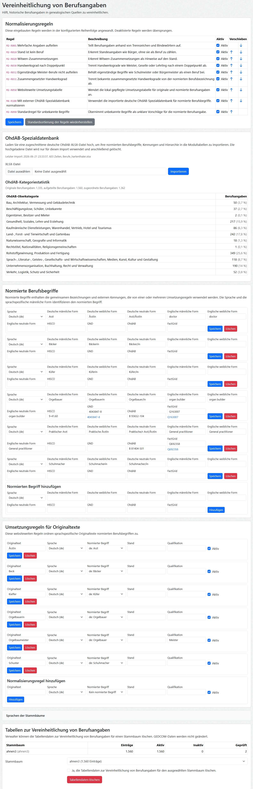

# **webtrees** module: Occupation Standardizer

This [webtrees](https://www.webtrees.net) module helps analyze and standardize historical occupation entries in genealogical sources.

## 📚 Contents

This README contains the following main sections:

* [Purpose](#Purpose)
* [Scope](#Scope)
* [Current functionality](#CurrentFunctionality)
* [Preliminary M4 workflow](#M4Workflow)
* [Screenshots](#Screenshots)
* [Roadmap](#Roadmap)
* [Literature and Links](#Literature)
* [Requirements](#Requirements)
* [Installation](#Installation)
* [Translation](#Translation)
* [Credits](#Credits)
* [License](#License)

## 🎯 Purpose

Historical church book entries and historical address books often combine occupations, social status, offices, honorary offices, employers, and spelling variants in a single phrase.
This makes direct evaluation difficult: a phrase such as `Bürger und Weingärtner` contains a social status and an occupation, while `Arztwitwe` may point to the former occupation of a deceased husband rather than to the occupation of the recorded woman.

Occupation names are among the most frequent person-specific details in genealogical sources.
They are therefore important entry points for social-structural analysis in economic, social, political, historical, medical, and other research fields.
Different occupation classifications may focus on activity profiles and industries, on education and qualification levels, or on social prestige and social structures.

Occupation terms are often gender-specific, for example `Magd`/`Knecht`, `Arzt`/`Ärztin`, or `Orgelbauer/in`.
For searching, grouping, and analysis, these variants should point to the same normalized occupation concept.
For display next to a concrete person, however, the module should use the appropriate gender-specific or neutral label where available.

The purpose of this module is to prepare historical occupation data for consistent display, review, translation, and later statistical evaluation. It supports:

* separating status from occupation, such as `Bürger und Weingärtner`
* normalizing spelling variants, such as `Kieffer` to `Küfer`, `Schuster` to `Schuhmacher`, or `Beck` to `Bäcker`
* treating craft grades such as master, journeyman, or apprentice as qualifiers rather than separate occupations
* keeping genuine master-compound occupations such as `schoolmaster` or `Bürgermeister` intact
* preserving the original wording from the source while showing the standardized form as an additional value
* building a hierarchy of occupations, for example for statistical summaries by occupation group
* making occupation labels translatable, at least for German and English
* adding unobtrusive labels to occupation facts so that users can see the normalized interpretation next to the original GEDCOM value
* linking normalized occupations to external occupation ontologies and authority data, such as OhdAB, FactGrid, GND, Wikidata, and HISCO

The module is deliberately conservative: it does not change GEDCOM data automatically. The original occupation text remains the genealogical source value. Normalized interpretations are stored in module-owned database tables and can be reviewed separately. A later transfer of selected module-owned information back into GEDCOM is intended, but the exact form and target structures still need to be clarified.

## 🔎 Scope

The module currently focuses on individual `INDI:OCCU` facts. Other possible places for occupation-related information, such as military rank, education, offices, or custom GEDCOM structures, are being evaluated separately.

The current implementation combines three perspectives:

* a list-menu page for visitors, members, and managers, showing occupation facts and their normalization labels
* module-owned normalization tables for managers and administrators
* control-panel settings for normalization rules, language defaults, local mapping tables, OhdAB imports, and maintenance actions

## ⚙️ Current Functionality

The module provides an occupation inventory as a new item in the webtrees lists menu.

The list reads only individual `OCCU` facts and shows:

* original occupation text
* individual
* date
* place from `PLAC`, with the linked shared-place hierarchy from `_LOC` when available
* employer or responsible agency from `AGNC`
* `TYPE`
* `NOTE`
* linked sources

If no occupation facts exist in the selected family tree, the list remains available and shows a suitable message.

Automatic normalization suggestions are stored in a module-specific database table, one entry per detected occupation part. The GEDCOM data remains unchanged.
This is important when one original occupation phrase is split into several interpreted parts. For example, one GEDCOM `OCCU` fact may create separate module entries for status, occupation, office, or qualification.

Managers and administrators can edit the stored normalization entries directly in the occupation list. Saving a correction does not automatically mark the entry as reviewed; the reviewed flag is an explicit decision. Manual changes are kept in the module table and do not modify GEDCOM data.

Administrators can maintain a site-wide normalization mapping table in the module settings. These rules can normalize language-specific variants such as feminine occupational forms and can store identifiers for HISCO, GND, OhdAB, and FactGrid.

The first M4 prototype can import a tailored German OhdAB Excel extract through the module settings. The uploaded file is used only for this import and is deleted afterwards. The module stores its original spellings, normalized concepts, FactGrid identifiers, and OhdAB hierarchy in module-owned norm tables. The new rule "Normalize with external OhdAB special database" then uses this imported source after the local mapping table and before the fallback rule.

Labels are shown next to occupation facts on the standard facts-and-events tab and in supported Vesta fact views. The label text is selected from the normalized occupation term. If available, the module prefers gender-specific or neutral labels and chooses German or English according to the user's language.

The currently implemented normalization rules are documented in [docs/normalization-rules.md](docs/normalization-rules.md).
The module-owned database tables are documented in [docs/database-schema.md](docs/database-schema.md).

## 🧭 Preliminary M4 Workflow

M4 prepares the use of external occupation norm data, especially OhdAB and FactGrid. The intended provisional workflow is:

1. Run a webtrees family tree against the full OhdAB occupation database.
2. Extract only the occupation names that are relevant for this family tree into a tailored Excel file.
3. Upload this tailored Excel file in the module settings and import it completely into the module tables.
4. Use the imported data as a local German norm source for occupation normalization.

This approach avoids importing the full OhdAB source into every webtrees installation. The full source is much larger and contains tens of thousands of occupation names, while a family-tree-specific extract can stay small, auditable, and practical for module-owned tables.

The tailored Excel file is currently expected to be German-language norm data. It can therefore only be applied to occupation terms whose language is `de`. The rule "Normalize with external OhdAB special database" runs after the local mapping table and before the fallback rule for unknown terms.

When the rule finds a match, the module uses the matched norm concept to add or update identifiers such as OhdAB and FactGrid, and to make the OhdAB hierarchy available without duplicating the hierarchy text in every occupation-list row.

After a successful import, the uploaded Excel file is no longer needed by webtrees. Re-import is necessary only when the tailored source file has changed.

One open question remains for new occupation terms that are later added to the webtrees family tree and are not yet present in the tailored Excel extract. A later M4 step needs a practical workflow for these individual additions, for example by searching the full OhdAB source on demand or by maintaining a small supplemental local mapping.

## 🖼 Screenshots

The screenshot shows the module settings in the webtrees control panel. The available sections depend on the current development state and on imported normalization data.

Screenshot of control panel

## ✨ Roadmap

* M1: OCCU inventory and read-only preview.
* M2: Local normalization rules, module-owned normalization table, occupation labels, and first manual editing of stored normalization entries.
* M3: Review refinements and reusable normalization rules, including extended editing of copied OCCU context fields and promoting manual corrections to reusable rules.
* M4: External norm data and exchange, including evaluation of FactGrid/OhdAB, Wikidata, GND, HISCO, licensing, hierarchy mapping, and export formats.

## 📖 Literature and Links

Useful background information and norm data sources:

* [OhdAB database on FactGrid](https://database.factgrid.de/wiki/FactGrid:OhdAB-Datenbank) - historical occupation database used as an external norm source for German occupation terms.

## 📌 Requirements

This module requires **webtrees** version 2.2.

## 📥 Installation

Copy the folder `hh_occupation_standardizer` into `webtrees/modules_v4` and enable the module in the webtrees control panel.

After installation, open the webtrees control panel and configure the module settings. Managers and administrators can then open the occupation list from the webtrees lists menu for each family tree.

## 🌍 Translation

The module is prepared for translation using gettext files in `resources/lang`.
Strings that are already translated by webtrees core are routed through the module's helper class and are intentionally not added to the module translation catalog.

The normalization data itself can contain language-specific labels. German and English masculine, feminine, and neutral occupation labels are supported for normalized occupation terms.

## 🙏 Credits

Developed by Hermann Hartenthaler with support from OpenAI Codex and JetBrains PhpStorm.

## 📄 License

* Copyright (C) 2026 Hermann Hartenthaler
* Derived from **webtrees** - Copyright 2026 webtrees development team.

This program is free software: you can redistribute it and/or modify
it under the terms of the GNU General Public License as published by
the Free Software Foundation, either version 3 of the License, or
at your option, any later version.
